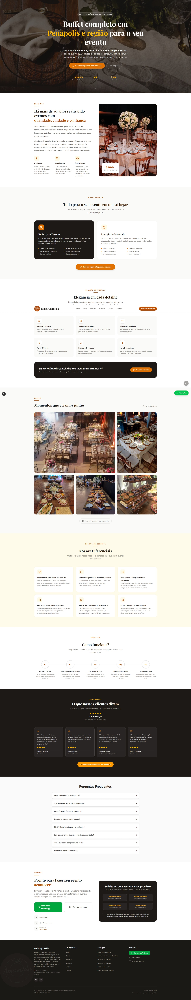
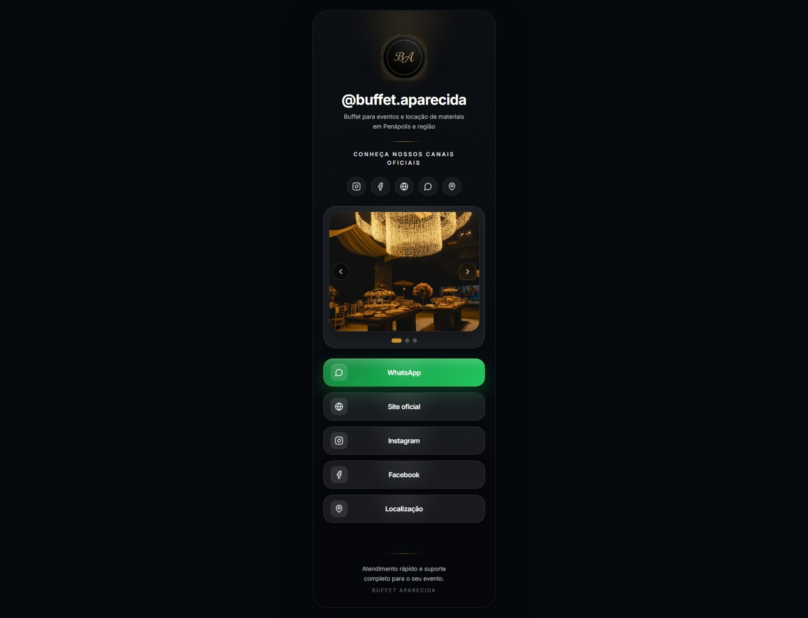
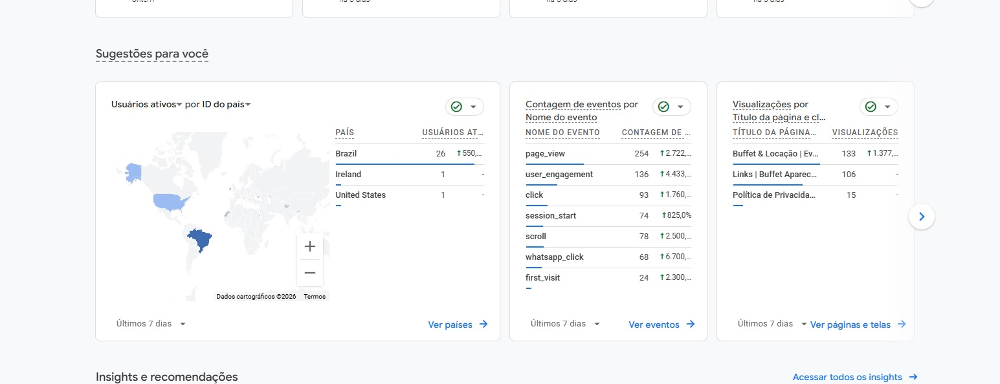
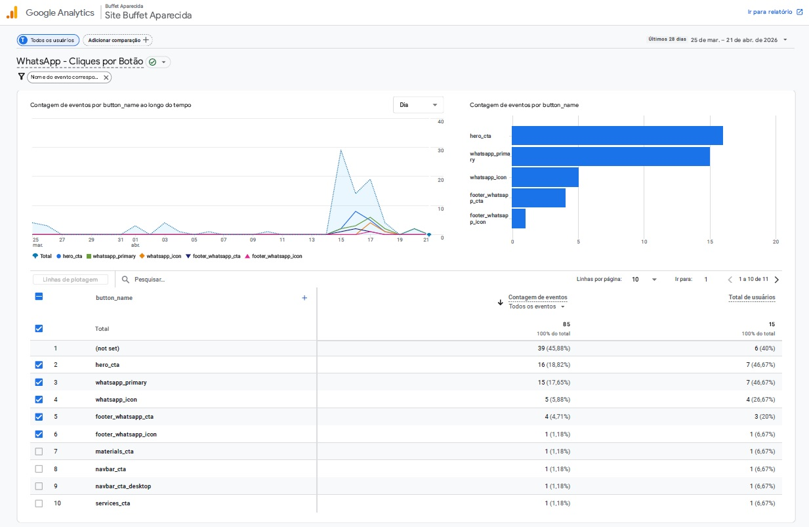
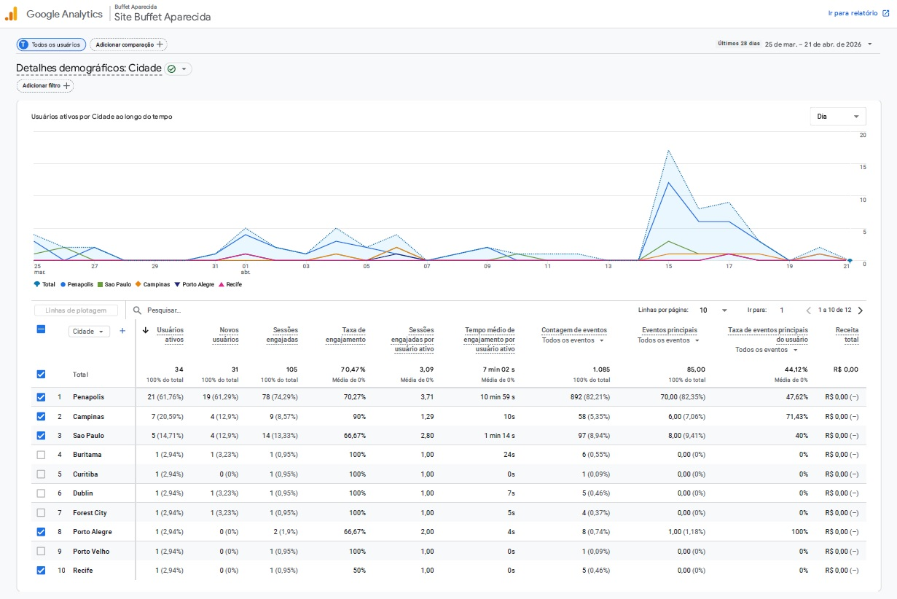

<div align="center">
  <h1>🍽️ Buffet Aparecida</h1>
  <p><strong>Site institucional responsivo desenvolvido com foco em apresentação de serviços, experiência do usuário e performance.</strong></p>

  
  
  
  
  
</div>

<br />

## 🌐 Demo

O projeto está publicado na Vercel:

👉 **[Acessar site online](https://buffet-aparecida.vercel.app/)**

---

## 🧠 Sobre o projeto

Este projeto foi desenvolvido como um **site institucional para buffet e locação de materiais**, com foco em:

- apresentação clara dos serviços
- navegação fluida em diferentes dispositivos
- reforço visual de credibilidade por meio de imagens reais
- organização de conteúdo voltada para apresentação comercial
- base técnica simples de manter e fácil de evoluir

Além da página principal, o projeto também inclui uma **rota `/links`**, pensada como uma página de entrada para uso na **bio do Instagram**, reunindo acessos rápidos aos canais principais da marca e facilitando a navegação do usuário a partir das redes sociais.

A proposta foi construir uma interface moderna, elegante e responsiva, capaz de comunicar valor com clareza e oferecer uma boa experiência ao usuário.

---

## 🖥️ Interface

### Home


---

### Página `/links`


---

## 📊 Analytics (GA4 + GTM)

A aplicação foi instrumentada com **Google Analytics 4 + Google Tag Manager**, permitindo análise real de comportamento.

### Visão geral


### Eventos por botão


### Dados por cidade


---

## ✨ Principais funcionalidades

- **Layout responsivo** para desktop, tablet e mobile
- **Hero section estratégica** com destaque inicial para proposta de valor
- **Separação clara entre serviços e locação de materiais**
- **Galeria com imagens reais**
- **Seção “Como Funciona”** para reduzir atrito na navegação
- **Microinterações e animações** com Framer Motion
- **Estrutura organizada de componentes** para facilitar manutenção e evolução do projeto
- **Página `/links` para bio do Instagram**, funcionando como hub de entrada com links rápidos para canais e páginas principais

---

## 📊 Analytics e monitoramento

O projeto utiliza **Google Tag Manager (GTM)** e **Google Analytics 4 (GA4)** para estruturar o acompanhamento da navegação e das principais interações do usuário.

Entre os dados que podem ser acompanhados com a instrumentação implementada, estão:

- **fontes de aquisição de tráfego**, como acessos vindos de Instagram, Google ou entrada direta
- **visualizações por página**, incluindo rotas como `/` e `/links`
- **eventos de interação**, como cliques em botões e links estratégicos
- **localização geográfica dos acessos**, com leitura de cidades e regiões
- **fluxo de navegação**, ajudando a entender o comportamento dos usuários dentro do site

Essa camada de monitoramento contribui para avaliar desempenho de páginas, canais de entrada e pontos de interação mais relevantes do projeto.

> Nesta versão pública, alguns detalhes operacionais e pontos de contato foram simplificados.

---

## 🛠️ Stack utilizada

- **Framework:** Next.js 16
- **Linguagem:** TypeScript
- **Biblioteca UI:** React 19
- **Estilização:** Tailwind CSS v4
- **Animações:** Framer Motion
- **Ícones:** Lucide React
- **Deploy:** Vercel

---

## ⚙️ Como rodar localmente

1. Clone o repositório:
   ```bash
   git clone https://github.com/lgustavoab/buffet-portfolio.git